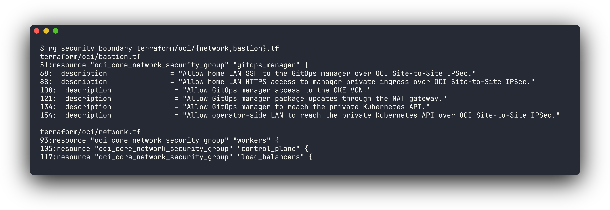
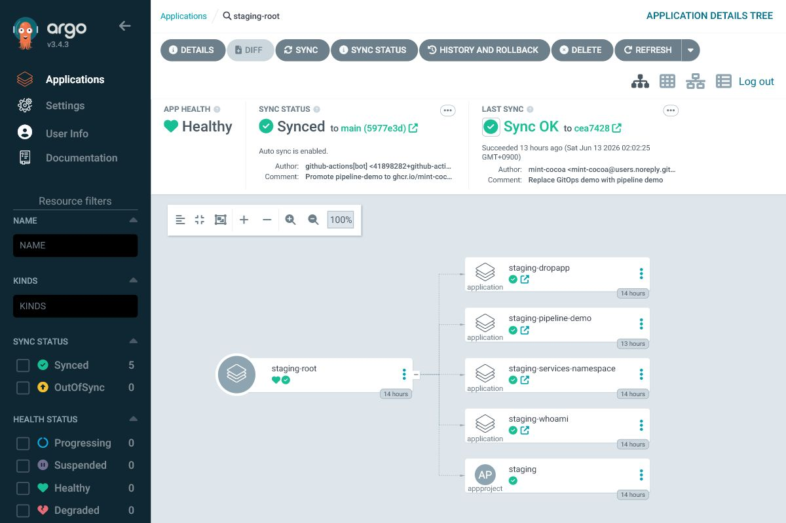
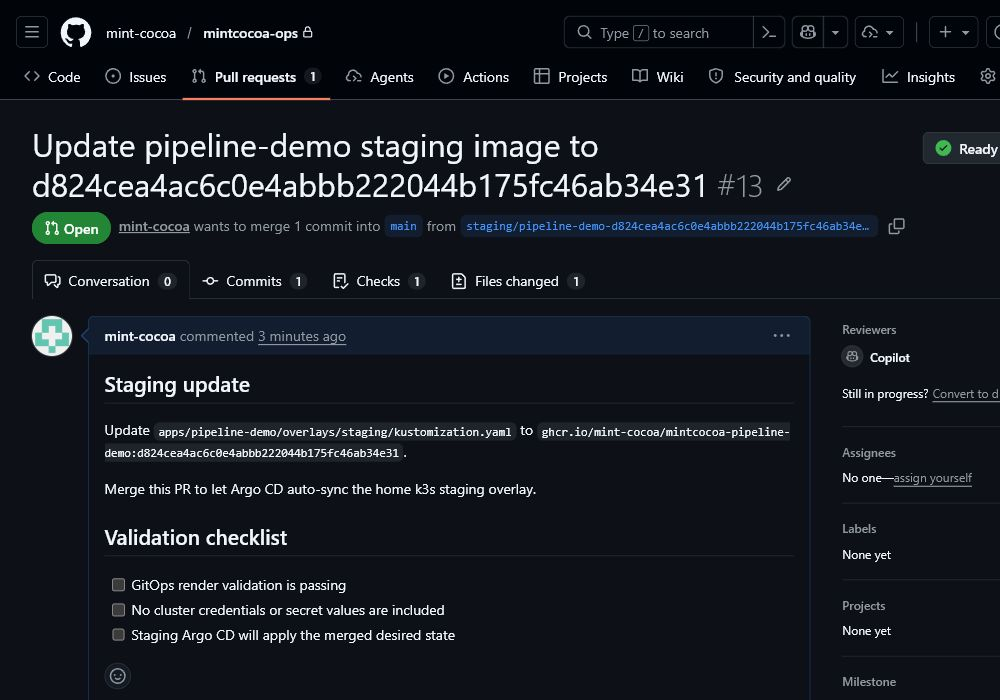
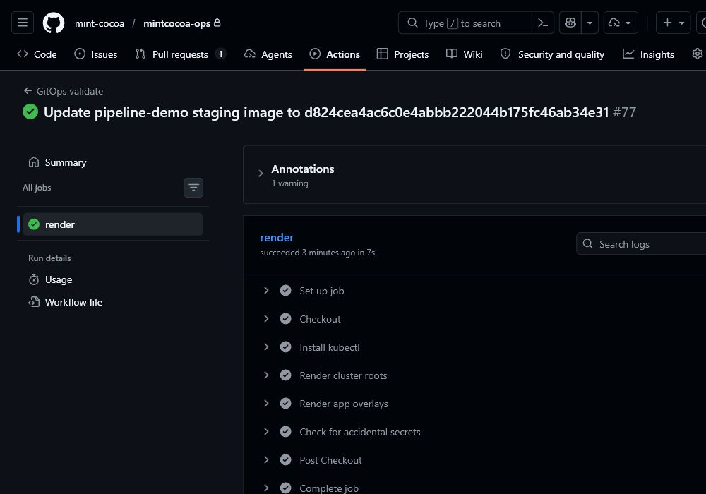

# MintCocoa Production Infrastructure Architecture

Azure AKS 기반 Kubernetes 환경으로 프로덕션 클러스터와 운영 접근 경계를 구축한 과정을 설명한 문서입니다. 홈랩에 의존하는 단일 서버 실험을 넘어 실제 운영 시 발생할 수 있는 문제를 고려하여 개발과 프로덕션 환경 분리, 관측성, 접근 권한 문제를 가정하며 설계했습니다.

## 1. 설계 기준

프로덕션 환경은 단일 서버 실험처럼 빠르게 구성하는 것보다, 트래픽 경로와 운영 권한, 배포 승인 과정을 처음부터 분리해 두는 것이 중요하다고 보았습니다. 그래서 클러스터 실행면, GitOps 제어면, 운영자 접근 경계를 별도 책임으로 나누었습니다.

Azure AKS는 public workload 실행 환경으로 사용하고, home LAN의 manager k3s는 Argo CD와 내부 운영 UI 프록시를 담당하도록 구성했습니다. 이 구조에서 public 서비스 경로, private 운영자 경로, GitOps 제어면을 독립적으로 검증할 수 있습니다.


## 2. 클러스터와 GitOps 저장소 구조

먼저 클러스터 안에서 사용자 트래픽, GitOps 제어, 운영자 접근 개념을 분리하고 namespace, ingress class, Load Balancer, 접근 경로 기준으로 나누었습니다.

| Plane | 책임 | 대표 구성 |
| --- | --- | --- |
| Public service plane | 외부 사용자가 접근하는 서비스 노출 | `docs.mintcocoa.dev`, `drop.mintcocoa.dev`, `demo.mintcocoa.dev`, public `nginx` ingress |
| GitOps control plane | staging/prod desired state 선언과 수렴 | `mintcocoa-ops`, GitOps manager Argo CD, Kustomize overlays |
| Private operator plane | 운영자 접근과 관측성 UI | Azure VPN Gateway, manager k3s proxy, private Grafana ingress |

## 3. Azure VNet과 Kubernetes 클러스터 구성

프로덕션 환경은 단순히 Kubernetes 클러스터를 하나 띄우는 것이 아니라, 네트워크 주소 공간과 워커 노드, Pod IP 할당 방식, 외부 노출 경로를 함께 설계해야 했습니다. 그래서 Azure VNet을 기준으로 클러스터의 기본 네트워크 경계를 먼저 만들고, 그 안에서 AKS가 worker node와 pod network를 관리하도록 구성했습니다.

AKS는 managed control plane을 제공하므로 직접 control plane VM을 운영하지 않아도 Kubernetes API와 node pool을 분리해서 다룰 수 있습니다. worker node는 `Standard_B2s_v2`로 구성했고, pod network는 Azure CNI를 사용해 Kubernetes 내부 주소 체계가 VNet subnet 설계와 자연스럽게 연결되도록 했습니다.

이 구성의 목적은 작은 비용으로도 프로덕션과 유사한 운영 조건을 만드는 것입니다. worker node 3대가 모두 `Ready` 상태인지 확인하고, 이후 네트워크 경계와 Azure NSG 섹션에서 public ingress, private 운영자 접근, pod outbound traffic이 어떤 경로로 분리되는지 검증합니다.

| 영역 | 구성 |
| --- | --- |
| Cloud provider | Microsoft Azure |
| Region | `southeastasia` |
| VNet | `10.40.0.0/16` |
| Kubernetes | Azure AKS cluster |
| Node pool | `Standard_B2s_v2`, 3 worker nodes |
| CNI | Azure CNI |
| Public ingress IP | `57.155.52.74` |
| Private ingress IP | `10.40.0.91` |


## 4. 네트워크 경계와 Azure NSG

public ingress와 private ingress는 외부 노출 경로와 내부 운영 경로를 분리하기 위한 기준입니다. public host는 외부 사용자 트래픽을 받고, operator-only host는 private access path 안에서만 사용합니다.

public-facing 리소스는 Azure public Load Balancer 경로를 사용하고, 운영자 UI와 관측성 UI는 Azure VPN Gateway와 manager k3s 프록시를 거치는 private 경로로 분리했습니다.


Azure VNet은 역할별 subnet으로 나누어집니다. AKS subnet은 worker node와 pod traffic을 수용하고, GatewaySubnet은 Azure VPN Gateway가 home LAN과 Site-to-Site IPsec을 맺는 영역입니다. GitOps manager는 home LAN의 `172.30.1.135` 호스트에서 k3s와 Argo CD를 운영하며, Azure private ingress로 접근할 때는 VPN 경로를 사용합니다.

```{mermaid}
flowchart LR
  publicUsers["External users"] --> publicDns["Public DNS"]
  publicDns --> edge["Azure public edge"]

  operator["Operator<br/>Home LAN"] --> cpe["manager<br/>strongSwan"]
  cpe --> ipsec["Azure Site-to-Site<br/>IPsec"]

  subgraph vnet["Azure VNet 10.40.0.0/16"]
    subgraph publicPath["Public exposure path"]
      edge --> publicLb["Azure public Load Balancer"]
      publicLb --> publicIngress["public nginx ingress"]
      publicIngress --> services["prod-services workloads"]
    end

    subgraph privatePath["Private operator path"]
      ipsec --> gateway["Azure VPN Gateway<br/>GatewaySubnet"]
      gateway --> manager["GitOps manager<br/>home LAN k3s"]
      manager --> privateApi["AKS API<br/>private access path"]
      manager --> privateLb["Azure internal Load Balancer"]
      privateLb --> privateIngress["private nginx ingress<br/>operator-only hosts"]
    end

    subgraph outboundPath["Pod outbound path"]
      services --> pods["Azure CNI pod traffic<br/>AKS subnet"]
      pods --> nat["AKS managed outbound"]
    end
  end

  nat --> internetOut["Outbound internet"]

  classDef public fill:#e8f2ff,stroke:#2563eb,color:#111827
  classDef private fill:#ecfdf3,stroke:#16a34a,color:#111827
  classDef outbound fill:#fff7ed,stroke:#ea580c,color:#111827
  class publicUsers,publicDns,edge,publicLb,publicIngress,services public
  class operator,cpe,ipsec,gateway,manager,privateApi,privateLb,privateIngress private
  class pods,nat,internetOut outbound
```

Azure 네트워크 보안은 Azure NSG, subnet, Load Balancer, VPN Gateway 경계를 기준으로 접근 범위를 나눕니다. 이 구성에서는 Kubernetes API 접근, node/pod traffic, public/private ingress traffic, GitOps manager 접근 경계를 서로 분리해 설명했습니다.




| Component | Role |
| --- | --- |
| Azure public Load Balancer | `docs.mintcocoa.dev`, `demo.mintcocoa.dev` 같은 public workload ingress |
| Azure internal Load Balancer | Grafana 같은 private observability ingress |
| Azure VPN Gateway | home LAN `172.30.1.0/24`와 Azure VNet `10.40.0.0/16` 사이 Site-to-Site IPsec |
| AKS node subnet | worker node, service, pod traffic 경계 |
| GitOps manager k3s | Argo CD 제어면과 private UI 프록시 진입점 |


운영면에서의 접근은 public user traffic과 분리했습니다. 외부 사용자는 public DNS와 public ingress를 통해 서비스에 접근하지만, 운영자는 home LAN에서 manager strongSwan 경로와 GitOps manager를 거쳐 private 운영 경로에 들어옵니다.


public Internet에 직접 노출되는 면적을 줄이고, 어디서 접속할 수 있는지를 home LAN과 GitOps manager 범위 안에서 통제하기 위해 이렇게 제한된 접근 경로로 설정했습니다.


## 5. GitOps 제어면

Production desired state는 prod 클러스터가 최종적으로 어떤 상태여야 하는지를 의미합니다. 모든 상태를 mintcocoa-ops 저장소 안에 선언적으로 표현하고, Argo CD가 이를 실제 prod 클러스터 상태와 비교해 일치하도록 관리합니다.

GitOps manager는 home LAN의 manager k3s에서 동작하고, Argo CD가 mintcocoa-ops 저장소를 바라보면서 “Git에 적힌 상태”와 “실제 Azure AKS 클러스터 상태”를 비교합니다.

GitOps 저장소는 역할별 root application으로 나누어집니다.

- manager-root: management 영역 상태를 관리
- staging-root: staging 클러스터 상태를 관리
- prod-root: production 클러스터 상태를 관리

각 root application은 Kustomize로 구성되어 있고, staging/prod overlay로 나뉩니다. staging은 빠르게 검증할 수 있도록 자동 Sync로 두고, prod는 수동 Sync로 두어 운영자가 변경 내용을 검토하고 승인할 수 있도록 했습니다.



production으로 보낼 때는 `mintcocoa-ops`의 promotion workflow가 staging overlay의 현재 `newName`/`newTag`를 읽어 `apps/<app>/overlays/prod/kustomization.yaml`로 복사하는 PR을 만듭니다.





이 PR이 merge되면 prod-root가 변경을 감지해 `OutOfSync`로 표시되고, 운영자가 diff와 staging 응답, GitHub Actions validation을 확인한 뒤 수동 Sync합니다. 이렇게 하면 production 배포 의도가 GitHub PR과 Argo CD operation 양쪽에 남게 되어 문제 발생 시 어느 단계에서 의도와 실제 상태가 달라졌는지 추적하기 쉽습니다.
