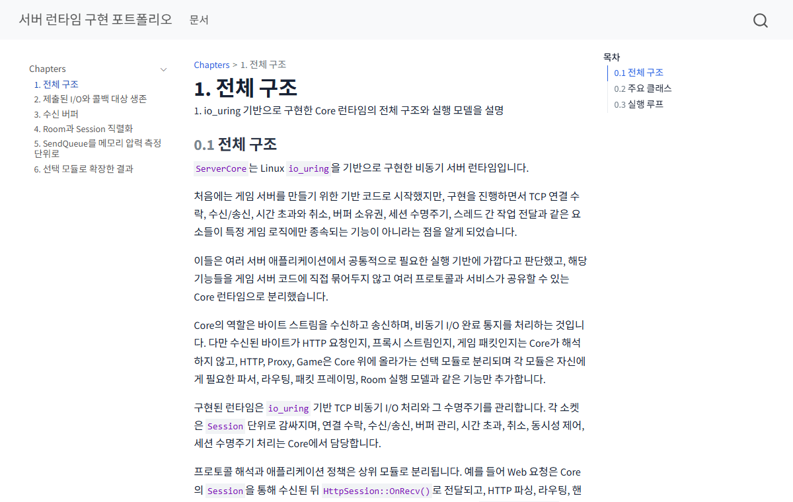
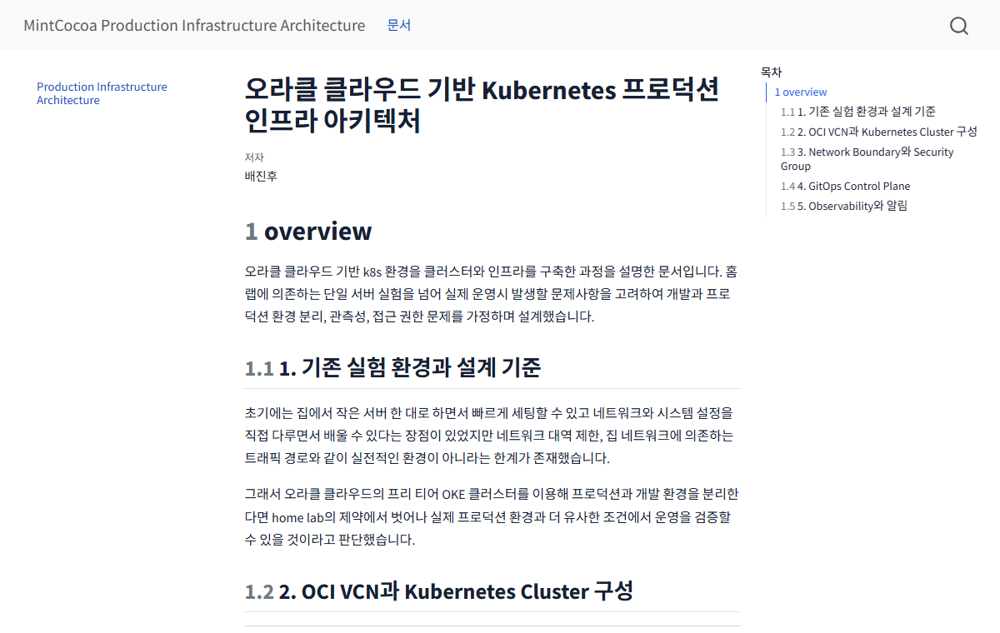

::: {.home}
::: {.intro}
## MintCocoa Docs

서버 런타임 구현과 클라우드·홈랩 운영 과정을 정리한 문서.
:::

::: {.section-heading}
### 문서
:::

::: {.doc-list}
::: {.doc-row}
::: {.doc-thumb}

:::

::: {.doc-body}
#### [io_uring 기반 C++ 서버 런타임 개발](/portfolio/servercore/)

`io_uring` 기반 C++ 서버 런타임의 수명관리, 버퍼, 직렬화, backpressure설계와 문제 해결 과정을 정리.
:::
:::

::: {.doc-row}
::: {.doc-thumb}

:::

::: {.doc-body}
#### [오라클 클라우드·홈랩 기반 개발-운영 파이프라인 구축](/portfolio/devops/)

GitHub Actions, GHCR, Argo CD, OKE production 배포와 운영, observability, AI 알림 시스템 구축 과정과 각 구간 설계 의도를 정리.
:::
:::
:::
:::
