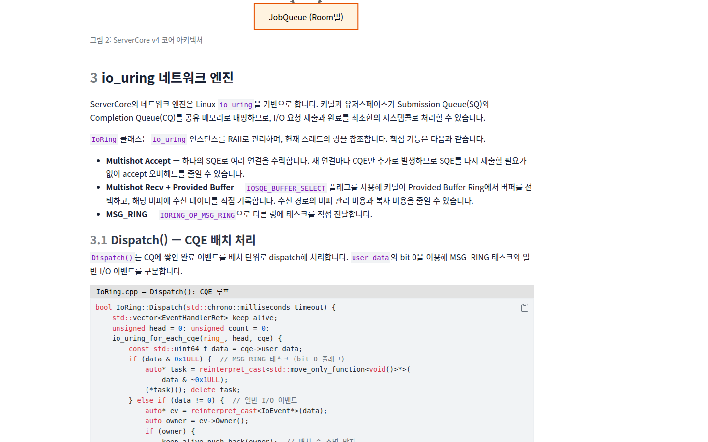
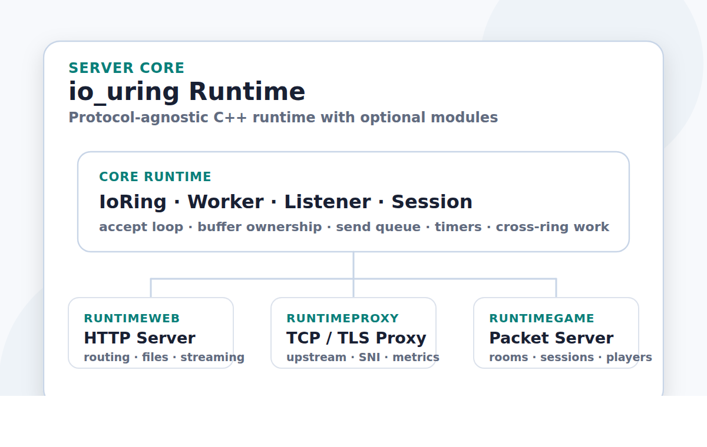
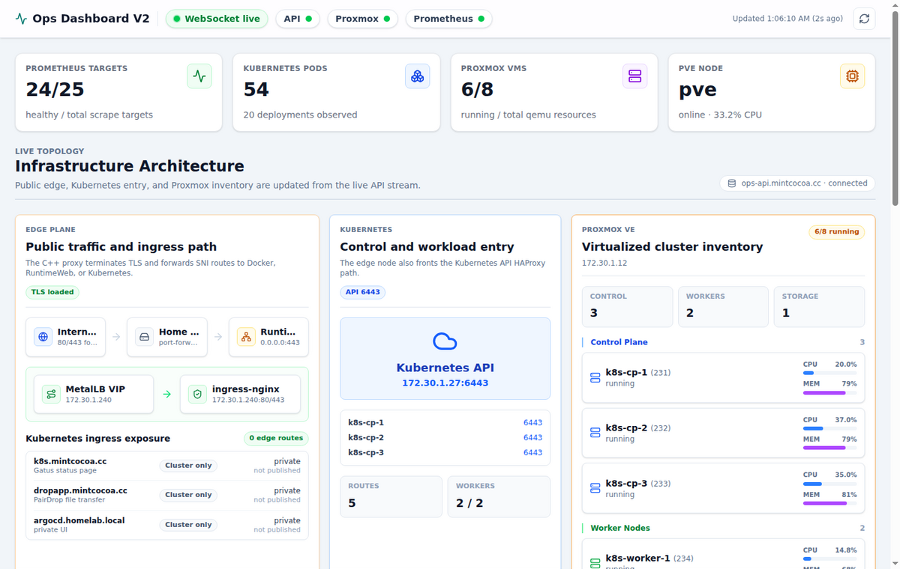

::: {.hero}
::: {.hero-copy}
## 주요 프로젝트

C++ 서버 런타임 구현, RuntimeWeb/Proxy/Game 모듈, DirectX 클라이언트,
홈랩 DevOps와 운영 관측성 문서를 한 곳에서 연결합니다.

::: {.hero-actions}
<a class="primary-action" href="/portfolio/">포트폴리오 문서 보기</a>
<a class="secondary-action" href="/portfolio/servercore/docs/1.overview.html">ServerCore 바로가기</a>
:::
:::
:::

::: {.project-grid}
::: {.project-card .featured}
{.card-image fig-alt=""}

### Server Core

`io_uring` 기반 C++ 런타임의 세션 수명관리, 버퍼 관리, 작업 큐,
backpressure, RuntimeWeb/Proxy/Game 모듈 경계를 정리한 문서입니다.

::: {.chip-row}
`C++` `io_uring` `Runtime` `Web` `Proxy` `Game`
:::

<a class="card-link" href="/portfolio/servercore/docs/1.overview.html">상세 문서</a>
:::

::: {.project-card}
{.card-image fig-alt=""}

### RuntimeWeb

HTTP 라우팅, 파일 서빙, streaming response, timeout과 backpressure 정책을
RuntimeWeb 선택 모듈 기준으로 설명합니다.

::: {.chip-row}
`HTTP` `Router` `Streaming`
:::

<a class="card-link" href="/portfolio/server/RuntimeWebPortfolio.html">상세 문서</a>
:::

::: {.project-card}
### RuntimeProxy

TCP reverse proxy, TLS 종료, SNI 기반 라우팅, ACME challenge와 metrics
snapshot 구조를 RuntimeProxy 모듈 기준으로 정리했습니다.

::: {.chip-row}
`TCP` `TLS` `SNI` `Metrics`
:::

<a class="card-link" href="/portfolio/server/RuntimeProxyPortfolio.html">상세 문서</a>
:::

::: {.project-card}
### RuntimeGame

PacketSession, PacketBuilder, Room, RoomManager, JobQueue 기반 Room 직렬
실행 구조를 멀티플레이 게임 서버 관점에서 다룹니다.

::: {.chip-row}
`Packet` `Room` `JobQueue`
:::

<a class="card-link" href="/portfolio/server/RuntimeGamePortfolio.html">상세 문서</a>
:::

::: {.project-card}
### DirectX 클라이언트

RuntimeGame 서버와 Protobuf 패킷을 주고받는 DirectX 11 아이소메트릭
던전 RPG 클라이언트의 렌더링, 씬 전환, 네트워크 처리를 정리합니다.

::: {.chip-row}
`DirectX 11` `Protobuf` `RPG Client`
:::

<a class="card-link" href="/portfolio/client/ClientPortfolio.html">상세 문서</a>
:::

::: {.project-card .featured}
{.card-image fig-alt=""}

### DevOps와 운영 관측성

GitHub Actions, GHCR, Argo CD, Kubernetes Ingress/TLS, OKE production 배포
경로와 운영 관측성 구현 기록을 정적 Quarto 문서로 제공합니다.

::: {.chip-row}
`Kubernetes` `GitOps` `Argo CD` `Observability`
:::

<a class="card-link" href="/portfolio/devops/DevOpsPortfolio.html">DevOps 문서</a>
<a class="card-link secondary" href="/portfolio/devops/OpsDashboard.html">운영 관측성</a>
:::
:::

::: {.exposure-band}
`GitHub push` -> `GitHub Actions` -> `_site/` render -> `GHCR image` -> `Argo CD` -> `https://docs.mintcocoa.dev/`

GitHub Pages mirror: `https://mint-cocoa.github.io/mintcocoa-docs/`
:::
