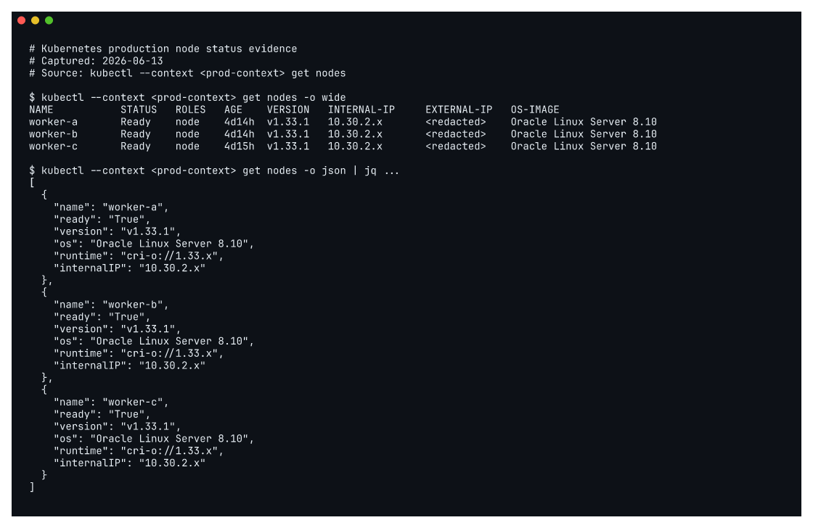

## 운영 기준 환경

`mintcocoa-ops`의 현재 기준은 OKE production입니다. home k3s는 staging, 개발, 내부 도구, 복구 훈련에 사용할 수 있지만 production workload가 home lab availability에 의존하지 않도록 분리했습니다.

이 분리는 단순한 이름 구분이 아닙니다. Argo CD root application, cluster application, workload overlay가 `manager`, `staging`, `prod` 경계를 따라 나뉘어 있습니다. production 상태는 GitOps manager의 Argo CD가 원격 OKE cluster에 수렴시키고, staging은 home k3s에서 먼저 검증하는 대상으로 유지합니다.

| 경계 | 역할 |
| --- | --- |
| `bootstrap/manager-root.yaml` | GitOps manager management plane root |
| `bootstrap/staging-root.yaml` | home k3s staging root |
| `bootstrap/prod-root.yaml` | OKE production root |
| `clusters/manager` | manager private ingress와 control plane application |
| `clusters/staging` | staging child applications |
| `clusters/prod` | production group root applications |
| `apps/<app>/base` | 환경 공통 workload 정의 |
| `apps/<app>/overlays/staging` | home k3s staging용 차이 |
| `apps/<app>/overlays/prod` | OKE production용 차이 |

아래 캡처는 production OKE cluster의 worker node 상태를 `kubectl`로 확인한 결과입니다. 공개 문서에서는 node private/public IP와 세부 식별자를 마스킹하지만, 3개 worker node가 모두 `Ready`이고 Kubernetes `v1.33.1`로 동작한다는 운영 상태는 남깁니다.



## Application 계층

OKE production의 cluster root는 역할별 group root application을 먼저 참조합니다. `clusters/prod/root-applications` 아래에서 platform, ingress, observability, workloads를 나누고, 각 group root가 자기 영역의 child application을 관리합니다.

| Application | 관리 대상 |
| --- | --- |
| `prod-platform-root` | `cert-manager`, `cluster-issuers`, `metrics-server`, `argo-rollouts` |
| `prod-ingress-root` | public `ingress-nginx`, private `private-ingress-nginx` |
| `prod-observability-root` | Prometheus/Grafana, Loki, Promtail, Tempo, datasource, private Grafana ingress |
| `prod-workloads-root` | `prod-services` namespace, docs, dropapp, whoami, pipeline-demo |

## desired state가 두 저장소로 나뉘는 이유

애플리케이션 저장소는 이미지를 만들고, 운영 저장소는 어떤 이미지가 어떤 환경에 배포되는지를 기록합니다. `mintcocoa-docs` 저장소는 `_site`를 렌더링하고 GHCR 이미지를 만들지만, OKE production에서 그 이미지를 쓰는 최종 선언은 `mintcocoa-ops/apps/mintcocoa-docs/overlays/prod/kustomization.yaml`에 남습니다.

이 구조에서는 배포된 이미지 tag가 Git commit SHA와 연결됩니다. 문제가 생기면 production manifest에서 image tag를 확인하고, 해당 tag가 어떤 문서 저장소 commit에서 만들어졌는지 되짚을 수 있습니다.

```text
mintcocoa-docs push
  -> render _site
  -> build ghcr.io/mint-cocoa/mintcocoa-docs:<sha>
  -> update mintcocoa-ops apps/mintcocoa-docs/overlays/prod
  -> Argo CD sync prod-mintcocoa-docs
```

## 공개 문서에서 마스킹한 값

`mintcocoa-ops` 문서에는 운영자가 확인하기 위한 endpoint와 network 값이 일부 남아 있습니다. 공개 포트폴리오에서는 값 자체보다 경계를 설명하는 것이 목적이므로 아래 값은 원문 그대로 노출하지 않습니다.

| 값 종류 | 공개 문서 처리 |
| --- | --- |
| Kubernetes API IP | private/public endpoint 역할만 설명 |
| private subnet IP | IPSec, GitOps manager, private ingress 경계만 설명 |
| OCID | 사용하지 않음 |
| token, kubeconfig, Secret value | 사용하지 않음 |
| 도메인, 앱 이름, 커밋 해시 | 검증 식별자로 사용 |

## 확인 명령

```bash
git -C /home/cocoa/mintcocoa-ops show HEAD:README.md
find /home/cocoa/mintcocoa-ops/apps /home/cocoa/mintcocoa-ops/clusters /home/cocoa/mintcocoa-ops/infrastructure -maxdepth 3 -type f
git -C /home/cocoa/mintcocoa-ops show HEAD:clusters/prod/kustomization.yaml
kubectl --context <prod-context> get nodes -o wide
```
