## Executive Summary

MintCocoa production 환경은 public service plane, GitOps control plane, private operator plane을 분리해 구성했습니다. 외부 사용자는 public ingress와 도메인을 통해 서비스에 접근하고, 운영자는 home LAN에서 OCI private network로 들어가는 별도 경로를 사용합니다.

이 문서는 홈랩 단일 서버 실험에서 출발한 환경을 OCI OKE 위의 production 기준 구조로 옮기면서, 접근 제어, 배포 승인, 관측성, 장애 추적 문제를 어떻게 작게 재현했는지 설명합니다. 핵심은 리소스의 크기가 아니라 책임의 분리입니다.

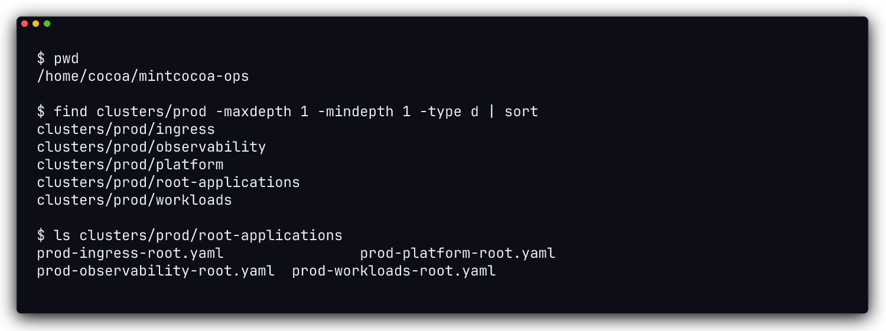

| Plane | 책임 | 대표 구성 |
| --- | --- | --- |
| Public service plane | 외부 사용자에게 공개되는 서비스 경로 | `docs.mintcocoa.dev`, `drop.mintcocoa.dev`, public `nginx` ingress |
| GitOps control plane | staging/prod desired state 선언과 수렴 | `mintcocoa-ops`, GitOps manager Argo CD, Kustomize overlays |
| Private operator plane | 운영자 접근과 관측성 UI | private Kubernetes API, OCI IPSec, GitOps manager, private Grafana ingress |

## 1. 기존 실험 환경과 설계 기준

초기에는 집의 작은 서버 한 대에서 빠르게 실험할 수 있었습니다. 직접 네트워크와 시스템 설정을 다루며 배울 수 있다는 장점은 컸지만, production 관점에서는 집 네트워크 품질, upstream router 설정, 전원, 회선 상태에 너무 많이 의존했습니다.

문제는 "서비스가 실행된다"와 "운영 가능한 형태로 노출된다"가 다르다는 점이었습니다. 홈랩에서는 LAN 안에서 접속이 되면 성공처럼 보이지만, 실제 운영에서는 사용자 트래픽, 관리자 접근, 배포 승인, 장애 확인 경로가 분리되어야 합니다.

그래서 Oracle Cloud Infrastructure의 OKE cluster를 production 기준 환경으로 두고, home k3s는 staging과 복구 훈련 역할로 분리했습니다. 이 선택은 managed Kubernetes를 쓰기 위한 목적만이 아니라, 작은 환경에서 production boundary를 검증하기 위한 선택이었습니다.

| 검증하고 싶었던 조건 | 설계 기준 |
| --- | --- |
| Public service exposure | 사용자 트래픽은 public ingress와 DNS로만 들어온다 |
| Operator access | Kubernetes API와 운영 UI는 private operator path에 둔다 |
| Deployment approval | staging 검증 후 production은 명시적인 PR과 수동 sync를 거친다 |
| Observability boundary | Grafana 같은 운영 화면은 public service plane과 분리한다 |

## 2. Cluster와 GitOps Repo 구조

클러스터 안에서는 사용자 트래픽, GitOps 제어, 운영자 접근을 namespace, ingress class, load balancer, 접근 경로 기준으로 나누었습니다. GitOps repo도 같은 의도를 드러내도록 환경별 root application과 역할별 group root로 정리했습니다.

| 계층 | 역할 |
| --- | --- |
| `manager-root` | GitOps manager 자체와 management plane 상태 관리 |
| `staging-root` | home k3s staging cluster 상태 관리 |
| `prod-root` | OKE production cluster 상태 관리 |
| `prod-platform-root` | cert-manager, cluster issuer, metrics-server, rollout controller |
| `prod-ingress-root` | public/private ingress controller |
| `prod-observability-root` | Prometheus/Grafana, Loki, Promtail, Tempo |
| `prod-workloads-root` | public workload와 `prod-services` namespace |

이 구조의 트레이드오프는 파일과 Application 수가 늘어난다는 점입니다. 하지만 단일 manifest에 모든 것을 넣으면 어떤 변경이 public 노출을 바꾸는지, 어떤 변경이 운영 접근 경계를 바꾸는지 알기 어려워집니다.

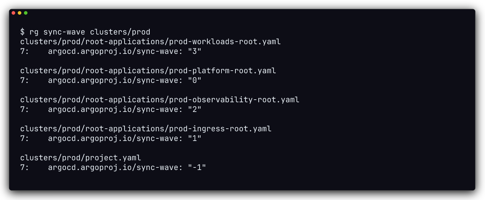

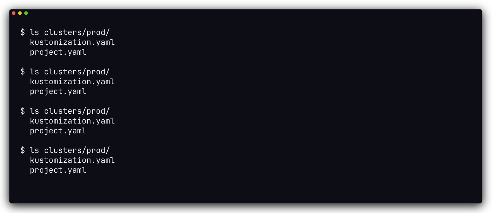

## 3. OCI VCN과 Kubernetes Cluster 구성

OCI 계층은 Terraform으로 관리합니다. Terraform은 VCN, subnet, route table, NSG, OKE cluster처럼 cloud infrastructure의 기반을 관리하고, Kubernetes manifest와 Argo CD는 cluster 안에서 수렴해야 하는 desired state를 관리합니다.

| 영역 | 구성 |
| --- | --- |
| Cloud provider | Oracle Cloud Infrastructure |
| Region | `ap-chuncheon-1` |
| Kubernetes | OKE basic cluster, Kubernetes `v1.33.1` |
| Node pool | `VM.Standard.A1.Flex`, 3 worker nodes |
| CNI | OCI VCN native pod networking |
| Node OS | Oracle Linux 8 managed node image |

아래 캡처는 production worker node 상태를 `kubectl`로 확인한 결과입니다. 공개 문서에서는 node IP와 세부 식별자를 마스킹하지만, worker 3대가 모두 `Ready`이고 Kubernetes `v1.33.1`로 동작한다는 운영 상태는 남깁니다.


VCN은 역할별 subnet으로 나누어집니다. endpoint subnet은 Kubernetes API endpoint를 위한 공간이고, pod subnet은 OCI VCN native CNI가 pod address를 할당하는 영역입니다. management subnet은 GitOps manager와 operator entry point가 위치하는 곳이라 public service subnet과 같은 의미로 취급하지 않습니다.

## 4. Network Boundary와 Security Group

public ingress와 private ingress는 같은 production cluster 안에 있지만 노출 의도가 다릅니다. public host는 외부 사용자 트래픽을 받고, operator-only host는 private access path 안에서만 사용합니다.

public-facing 리소스는 Internet Gateway 경로를 사용하고, pod outbound traffic은 NAT Gateway 경로를 사용하도록 해 public ingress, private API, pod outbound traffic의 경로를 분리했습니다.

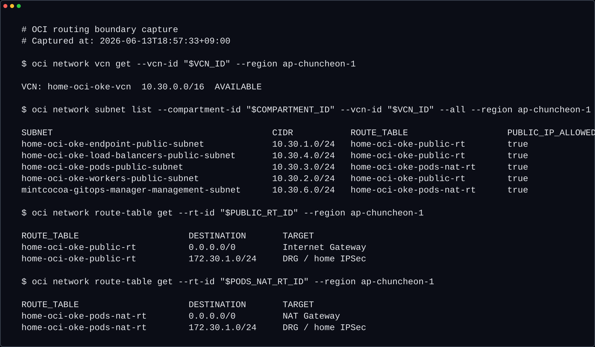

보안 그룹은 Kubernetes API 접근, node/pod traffic, public/private ingress traffic, GitOps manager 접근 기준으로 나누어 설정했습니다.

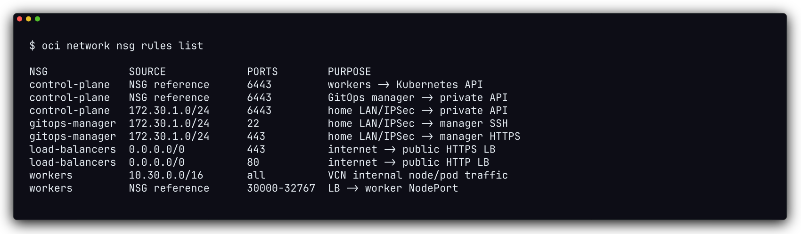

| Component | Role |
| --- | --- |
| Internet Gateway | public ingress와 OKE public endpoint |
| NAT Gateway | pod subnet의 outbound traffic |
| Control plane NSG | Kubernetes API 접근 제한 |
| Workers NSG | node와 pod traffic 경계 |
| Load balancer NSG | public/private ingress load balancer traffic 경계 |
| Manager NSG | home LAN SSH/HTTPS, GitOps management 진입점 |

아래 캡처는 같은 경계를 OCI CLI 조회 결과로 요약한 것입니다. public ingress load balancer는 public address를 갖고, private ingress load balancer는 VCN 내부 address만 갖습니다. manager NSG는 home LAN 경로의 SSH/HTTPS만 허용해 operator-only path를 public service path와 분리합니다.

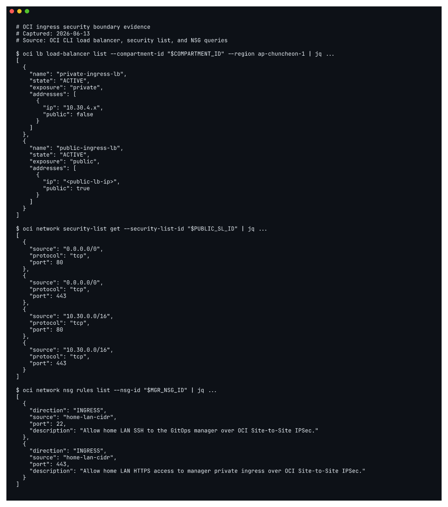

## 5. Private Operator Access

운영 접근은 public user traffic과 분리했습니다. 외부 사용자는 public DNS와 public ingress를 통해 서비스에 접근하지만, 운영자는 home LAN에서 Raspberry Pi IPSec CPE와 GitOps manager를 거쳐 private 운영 경로에 들어옵니다.

```text
LAN client
  -> Raspberry Pi IPSec CPE
  -> OCI Site-to-Site IPSec
  -> GitOps manager
  -> OKE private API / private ingress
```

이 접근 모델은 public Kubernetes API나 운영 UI를 넓게 여는 방식보다 불편합니다. 대신 public internet에 직접 노출되는 면적을 줄이고, 누가 운영자가 될 수 있고 어디서 접속할 수 있는지를 home LAN과 GitOps manager 범위 안에서 통제할 수 있습니다.


## 6. GitOps Control Plane

Production desired state는 prod cluster가 최종적으로 어떤 상태여야 하는지를 의미합니다. 이 상태는 `mintcocoa-ops` 저장소 안에 선언되어 있고, GitOps manager의 Argo CD가 실제 cluster 상태와 비교해 일치하도록 관리합니다.

Staging은 빠르게 검증할 수 있도록 자동 sync에 가깝게 운영하고, production은 promotion PR과 수동 sync gate를 둡니다. 이 차이는 속도와 안정성의 절충입니다.

```text
application repo push
  -> image build
  -> staging overlay update
  -> staging runtime validation
  -> production promotion PR
  -> operator review
  -> Argo CD production sync
```

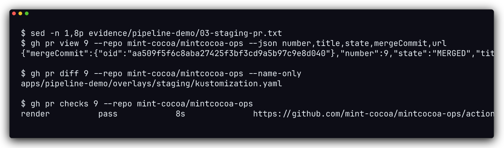

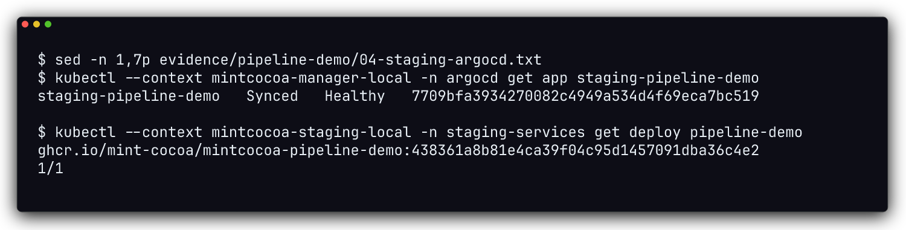

Production으로 보낼 때는 `mintcocoa-ops`의 promotion workflow가 staging overlay의 현재 image name/tag를 읽어 prod overlay로 복사하는 PR을 만듭니다. 이 방식은 운영자가 임의의 tag를 production에 직접 입력하는 대신, staging에서 확인된 tag를 production으로 승격했다는 기록을 남깁니다.

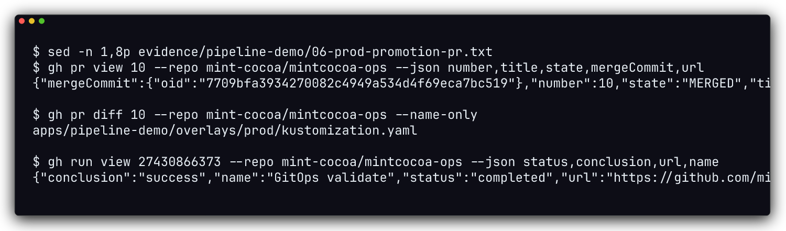

PR이 merge되면 Argo CD는 변경을 감지해 `OutOfSync`로 표시하고, 운영자가 diff, staging 응답, GitHub Actions validation을 확인한 뒤 수동 sync합니다. 이렇게 하면 production 배포 의도가 GitHub PR과 Argo CD operation 양쪽에 남습니다.

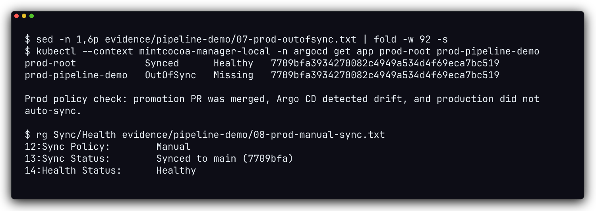

## 7. Observability Boundary

관측성 구성도 public service plane과 분리했습니다. Prometheus, Loki, Tempo는 cluster 내부 서비스로 남기고, Grafana만 private ingress 뒤에서 운영자가 접근합니다.

| 구성요소 | 역할 |
| --- | --- |
| `metrics-server` | 기본 resource metrics |
| `kube-prometheus-stack` | Prometheus, Grafana, Alertmanager, kube-state-metrics, node-exporter |
| `loki` | log storage |
| `promtail` | node log shipping |
| `tempo` | trace ingest/query |
| `grafana-datasources` | Loki와 Tempo datasource 연결 |

production 비용과 footprint를 줄이기 위해 observability storage는 작은 cluster에 맞춘 profile로 정리했습니다. 이 선택은 데이터 장기 보존보다 작은 OKE 환경에서의 운영 확인을 우선한 결과입니다.

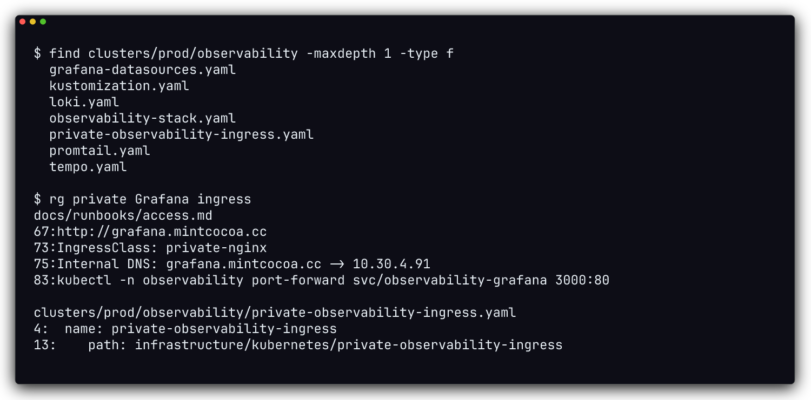

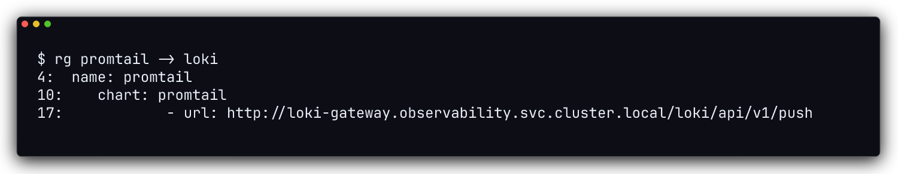

## 8. Design Tradeoffs

이 구조는 free-tier 규모의 작은 cluster를 전제로 합니다. 고가용성이나 대규모 트래픽보다 boundary와 traceability를 우선했습니다.

| 선택 | 장점 | 비용 |
| --- | --- | --- |
| OKE production과 home staging 분리 | 집 네트워크 장애가 public service availability를 좌우하지 않음 | 운영자가 두 환경의 차이를 이해해야 함 |
| public/private ingress 분리 | 사용자 트래픽과 운영 UI 노출면 분리 | ingress class와 DNS 관리가 늘어남 |
| GitOps root/group application 분리 | 변경 책임과 sync 단위가 명확함 | Application 수가 늘어남 |
| staging-first promotion | production image tag의 출처를 추적 가능 | 즉시 배포보다 절차가 길어짐 |
| private operator path | API/UI 공개 면적 감소 | 초기 네트워크 설정과 접근 검증이 복잡함 |

## 9. Runtime Verification

현재 runtime 검증은 세 축으로 남깁니다.

| 확인 대상 | 검증 방식 |
| --- | --- |
| OKE runtime | `kubectl get nodes`, OKE cluster/node pool status |
| Network boundary | OCI route table, security list, NSG, load balancer 조회 |
| GitOps deployment | GitHub PR, Argo CD sync state, production rollout 상태 |

공개 문서에는 domain, repository, application name, commit hash처럼 검증 가능한 식별자는 남깁니다. 반면 Kubernetes API IP, OCID, token, Secret value는 그대로 노출하지 않고 역할과 경계만 설명합니다.
