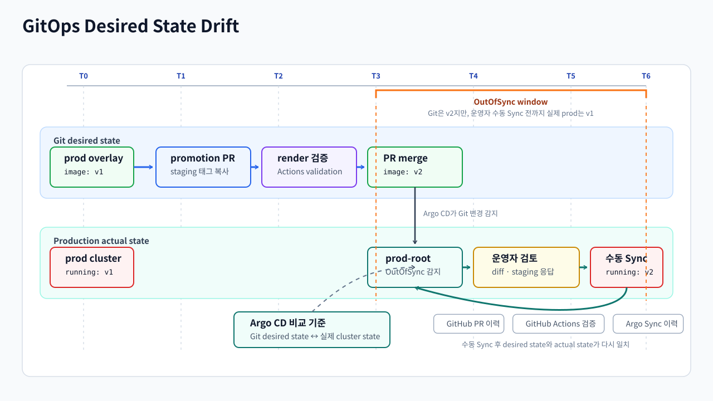
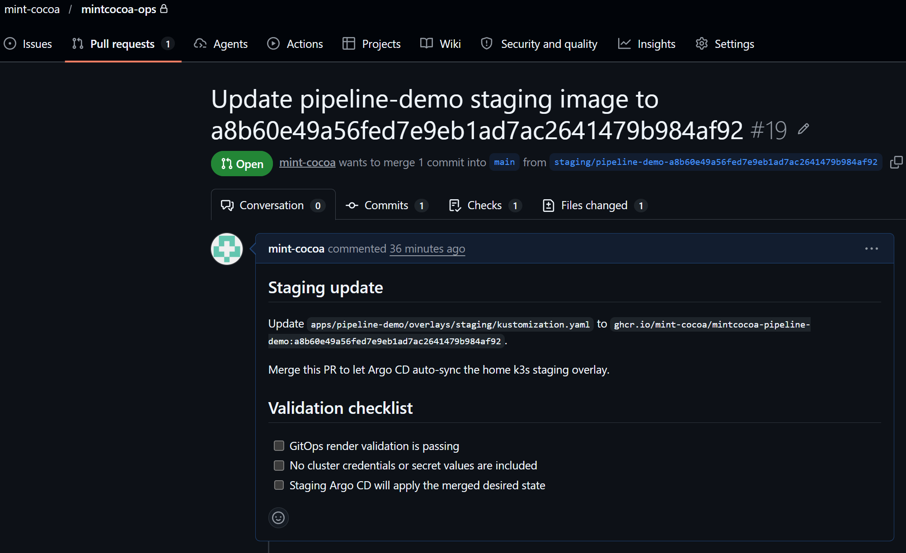
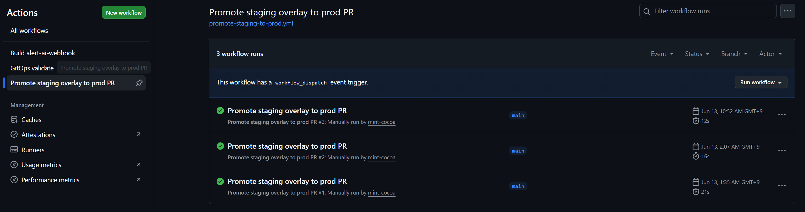
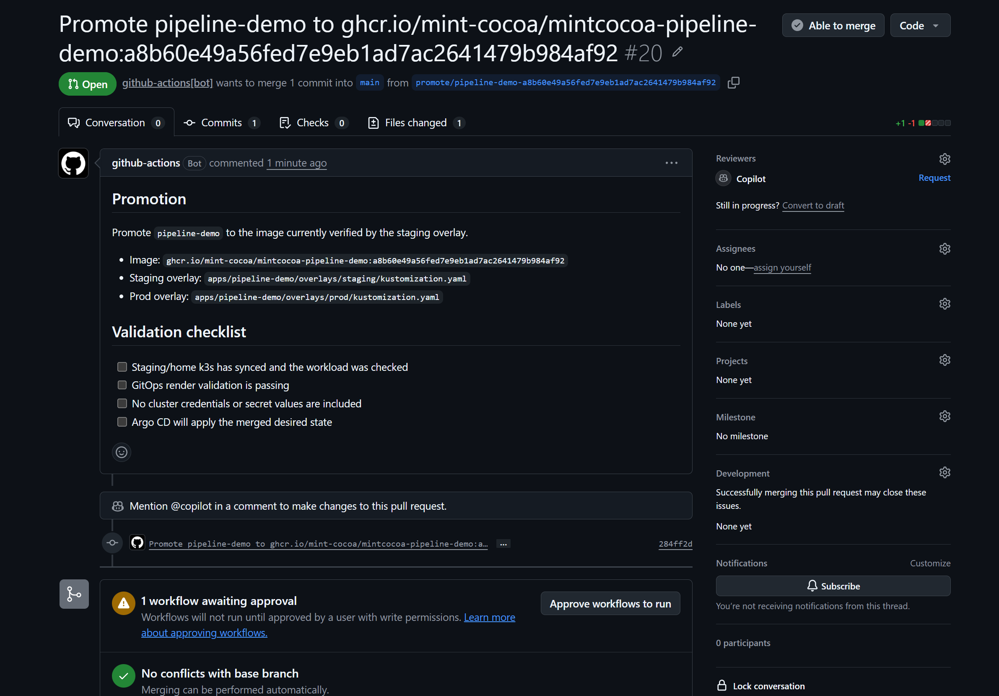
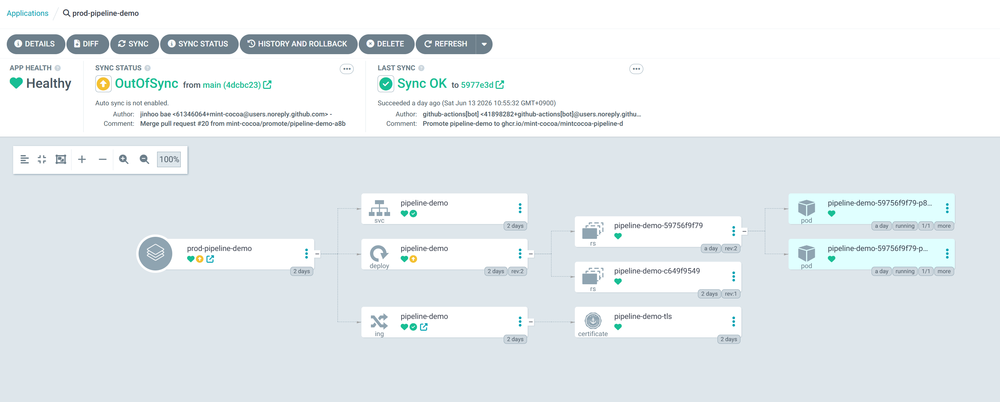
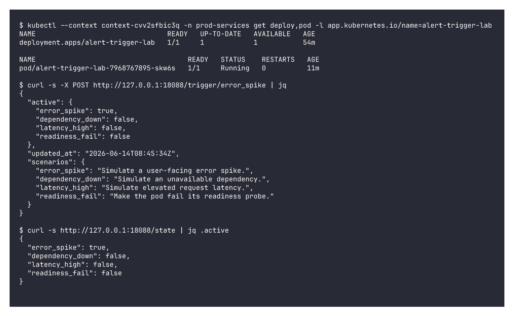
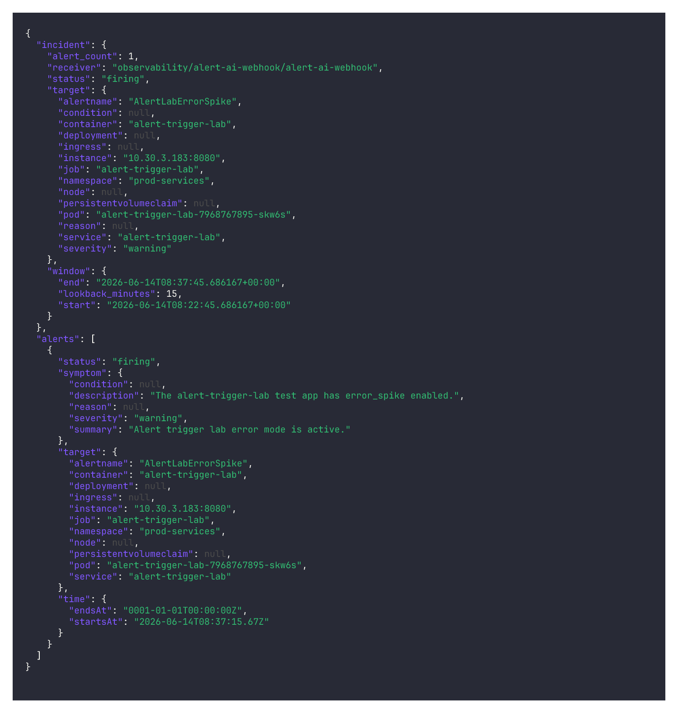
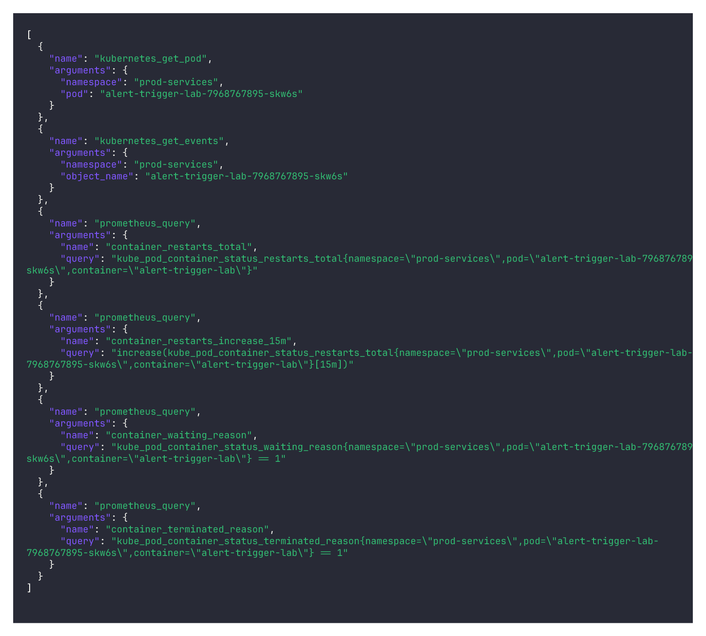
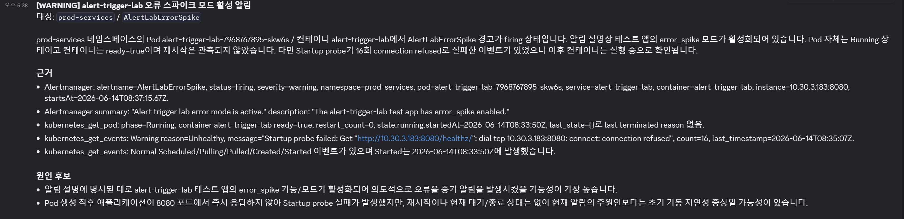

# overview

Azure AKS 기반 k8s 환경으로 프로덕션 클러스터와 운영 접근 경계를 구축한 과정을 설명한 문서입니다. 홈랩에 의존하는 단일 서버 실험을 넘어 실제 운영시 발생할 문제사항을 고려하여 개발과 프로덕션 환경 분리, 관측성, 접근 권한 문제를 가정하며 설계했습니다.

## 1. 기존 실험 환경과 설계 기준

초기에는 집에서 작은 서버 한 대로 하면서 빠르게 세팅할 수 있고 네트워크와 시스템 설정을 직접 다루면서 배울 수 있다는 장점이 있었지만
네트워크 대역 제한, 집 네트워크에 의존하는 트래픽 경로와 같이 실전적인 환경이 아니라는 한계가 존재했습니다.

그래서 Azure AKS 클러스터를 운영 기준 환경으로 두고 public 서비스 경로, private 운영자 경로, GitOps 제어면을 분리하면
home lab의 제약에서 벗어나 실제 프로덕션 환경과 더 유사한 조건에서 운영을 검증할 수 있을 것이라고 판단했습니다.

## 2. Azure VNet과 Kubernetes Cluster 구성

| 영역 | 구성 |
| --- | --- |
| Cloud provider | Microsoft Azure |
| Region | `southeastasia` |
| VNet | `10.40.0.0/16` |
| Kubernetes | Azure AKS cluster |
| Node pool | `Standard_B2s_v2`, 3 worker nodes |
| CNI | Azure CNI |
| Public ingress IP | `57.155.52.74` |
| Private ingress IP | `10.40.0.91` |

AKS는 managed control plane을 제공하므로 직접 control plane VM을 운영하지 않아도 Kubernetes API와 node pool을 분리해서 다룰 수 있습니다. Azure VNet `10.40.0.0/16` 안에 AKS node subnet과 GatewaySubnet을 두고, public ingress는 Azure LoadBalancer의 public IP로, private observability ingress는 internal LoadBalancer IP로 분리했습니다.

## 3. Network Boundary와 Security Group

public ingress와 private ingress는 외부 노출 경로와 내부 경로를 분리하기 위해 public host는 외부 사용자 트래픽을 받고,
operator-only host는 private access path 안에서만 사용합니다.

public-facing 리소스는 Azure public LoadBalancer 경로를 사용하고, 운영자 UI와 관측성 UI는 Azure VPN Gateway와 manager k3s 프록시를 거치는 private 경로로 분리했습니다.

Azure VNet은 역할별 subnet으로 나누어집니다. AKS subnet은 worker node와 pod traffic을 수용하고, GatewaySubnet은 Azure VPN Gateway가 home LAN과 Site-to-Site IPsec을 맺는 영역입니다. GitOps manager는 home LAN의 `172.30.1.135` 호스트에서 k3s와 Argo CD를 운영하며, Azure private ingress로 접근할 때는 VPN 경로를 사용합니다.

보안 그룹(NSG)은 Kubernetes API 접근, node/pod traffic, public/private ingress traffic, GitOps manager 접근 기준으로 나누어 설정했습니다.

| Component | Role |
| --- | --- |
| Azure public LoadBalancer | `docs.mintcocoa.cc`, `demo.mintcocoa.cc` 같은 public workload ingress |
| Azure internal LoadBalancer | Grafana 같은 private observability ingress |
| Azure VPN Gateway | home LAN `172.30.1.0/24`와 Azure VNet `10.40.0.0/16` 사이 Site-to-Site IPsec |
| AKS node subnet | worker node, service, pod traffic 경계 |
| GitOps manager k3s | Argo CD 제어면과 private UI 프록시 진입점 |

public internet에 직접 노출되는 면적을 줄이고, 어디서 접속할 수 있는지를 home LAN과 GitOps manager 범위 안에서 통제하기 위해서 이렇게 제한 된 접근 경로로 설정했습니다.

## 4. GitOps Control Plane

모든 상태를 mintcocoa-ops 저장소 안에 선언적으로 표현하고 Argo CD가 이를 실제 prod 클러스터 상태와 비교해 일치하도록 관리합니다.

GitOps manager는 home LAN의 manager k3s에서 동작하고, Argo CD가 `mintcocoa-ops` 저장소를 바라보면서 Git에 적힌 상태와 실제 Azure AKS 클러스터 상태를 비교합니다. dev branch에 push된 변경 사항은 staging 경로에서 빠르게 검증하고, production으로 promotion할 때는 PR과 수동 Sync로 운영자가 변경 내용을 검토하고 승인할 수 있도록 했습니다.

애플리케이션 저장소에서 새 이미지가 만들어지면 먼저 staging overlay를 바꾸는 PR이 열립니다. 예를 들어 `pipeline-demo`는 새 commit SHA로 build된 이미지를 `apps/pipeline-demo/overlays/staging/kustomization.yaml`에 반영하고, 이 PR이 merge되면 staging Argo CD가 자동으로 적용합니다.

production으로 보낼 때는 `mintcocoa-ops`의 promotion workflow가 staging overlay의 현재 `newName`/`newTag`를 읽어 `apps/<app>/overlays/prod/kustomization.yaml`로 복사하는 PR을 만듭니다. 이때 prod image tag를 직접 입력하지 않고, staging에 먼저 배포되어 검증된 tag만 production으로 승격되도록 했습니다.

수동 실행 화면에서는 앱 이름만 입력합니다. workflow는 입력받은 앱의 staging/prod overlay 경로를 계산하고, staging에 기록된 image tag를 prod overlay로 복사합니다.

`pipeline-demo` promotion PR은 staging에서 검증된 image tag와 staging/prod overlay 경로를 함께 남겨 production 변경이 어떤 staging 결과에서 왔는지 PR에서 바로 추적할 수 있습니다.

이 PR이 merge되면 prod-root가 변경을 감지해 `OutOfSync`로 표시되고, 운영자가 diff와 staging 응답, GitHub Actions validation을 확인한 뒤 수동 Sync합니다. 이렇게 하면 production 배포 의도가 GitHub PR과 Argo CD operation 양쪽에 남게 되어 문제 발생 시 어느 단계에서 의도와 실제 상태가 달라졌는지 추적할수 있습니다.

## 5. Observability와 알림

프로덕션 클러스터에는 여러 observability 도구를 구성해 메트릭, 로그, 트레이스, 대시보드를 확인할 수 있도록 했습니다. 이 구성에서 알림을 붙일 때 
장애 감지의 기준은 PrometheusRule과 Alertmanager에 두고, LLM는 이미 발생한 알림을 바탕으로 증거를 수집해 분석하는 역할로 설계했습니다.

| 분류 | AI에게 전달하는 값 |
| --- | --- |
| 대상 | `alertname`, `namespace`, `pod`, `deployment`, `service`, `ingress`, `container`, `node`, `instance`, `job` |
| 증상 | `severity`, `reason`, `condition`, annotation의 `summary`, `description` |
| 시간 | `startsAt`, `endsAt`, 최근 조회 window |
| 상태 | firing/resolved 상태, receiver, 같은 그룹의 alert 수 |

추가적인 정보는 AI가 먼저 어떤 증거를 확인해야 할지 읽기 전용 tool call로 요청하도록 했습니다. `alert-ai-webhook`은 AI가 요청한 whitelist tool만 실행하는 executor역할, 직접 `kubectl`을 실행하거나 클러스터에 접속하는 구조가 아니라 AI가 필요한 정보를 요청하면 `alert-ai-webhook`이 허용된 범위 내에서 조회해 결과를 전달하는 구조로 설계했습니다.

| Tool | 역할 | 제한 |
| --- | --- | --- |
| `prometheus_query` | PromQL instant query 실행 후 최대 10개 row로 축약 | Alertmanager 대상 범위 안의 read query만 사용 |
| `loki_error_logs` | namespace, pod, container, keyword 기준 로그 조회 | 마스킹, 중복 제거, 최대 20 line 제한 |
| `kubernetes_get_pod` | pod phase, containerStatuses, lastState 조회 | alert fact의 namespace/pod 범위로 제한 |
| `kubernetes_get_events` | 대상 object event 최근 10개 조회 | 변경 이벤트 생성 없이 read-only 조회만 수행 |
| `kubernetes_get_deployment` | replicas, ready/available replicas, conditions 조회 | alert fact의 namespace/deployment 범위로 제한 |

문제 발생 시 처리 흐름은 다음과 같습니다.

1. Prometheus가 기본 Kubernetes/Node/Prometheus 룰을 평가하고, 룰이 firing 상태가 되면 Alertmanager가 alert label과 annotation을 포함한 webhook payload를 생성합니다.
2. Alertmanager는 내부 Kubernetes service인 `alert-ai-webhook`으로 webhook을 전달합니다.
3. `alert-ai-webhook`는 대상, 증상, 시간 정보만 추출해 AI에게 전달하는 1차 프롬프트로 AI에게 알림 사실을 전달합니다. 
4. 1차 프롬프트는 AI에게 Alertmanager 사실만 보고 필요한 조회를 tool로 요청하라고 지시합니다.
5. AI는 필요한 Prometheus, Loki, Kubernetes 조회를 읽기 전용 tool call로 요청하고, 이 요청은 `ai_trace ai_requested_tools`로 남습니다.
6. 실행 결과는 `ai_trace tool_results`로 남기고, Alertmanager 사실과 tool 결과를 다시 OpenAI Responses API에 전달합니다.
7. 2차 프롬프트는 조회 결과를 근거로만 최종 분석을 작성하게 하고, structured output으로 결과를 받습니다.
8. Discord에는 요약, 근거, 원인 후보, AI가 요청해 실행된 PromQL/LogQL/Kubernetes 조회와 결과를 함께 보냅니다.

실제  운영 클러스터에 배포한 `alert-trigger-lab` 앱으로 진행했습니다. 이 앱은 평소에는 정상 Pod로 동작하고,
외부에서 `/trigger/error_spike` 같은 endpoint를 호출하면 PrometheusRule이 감지할 수 있는 상태 metric을 노출해  Alertmanager, webhook, 1차 AI 조회 계획, tool 실행, 2차 AI 분석까지의 경로를 재현했습니다.

먼저 테스트 앱이 정상 배포된 상태에서 `error_spike` 상태를 켜고, Prometheus가 `AlertLabErrorSpike` 알림을 firing 상태로 만드는지 확인했습니다.

Alertmanager가 보낸 payload에서 1차 입력에 필요한 발생 대상, 증상, 시간, 상태만 추출해 `ai_trace alert_fact_context`로 남깁니다.

1차 AI는 이 사실만 보고 필요한 도구를 선택합니다.

`alert-ai-webhook`은 AI가 요청한 조회가 허용된 범위인지 확인해 실행하고, 결과를 `ai_trace tool_results`로 남깁니다. 여기서는 `kubernetes_get_pod`, `kubernetes_get_events`, `prometheus_query`가 실행된 것을 볼 수 있습니다.

최종 분석은 Discord 알림으로 전달되고, 여기에는 1차 AI가 수집한 데이터, 판단 근거, 증상과 원인 후보, 사용된 조회 결과가 함께 포함됩니다.
또한 AI 결론만 보는 것이 아니라 어떤 사실과 조회 결과를 근거로 판단했는지도 함께 검증할 수 있습니다.
   
