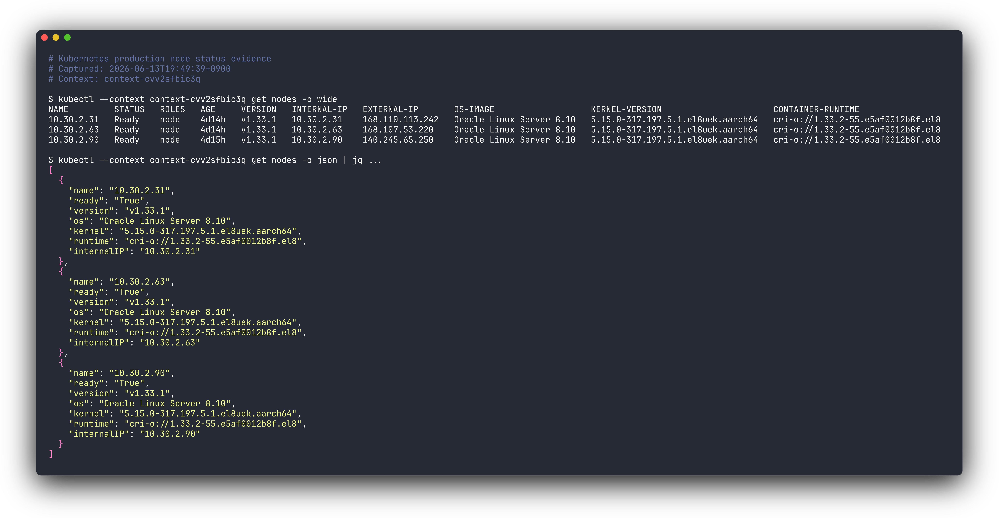
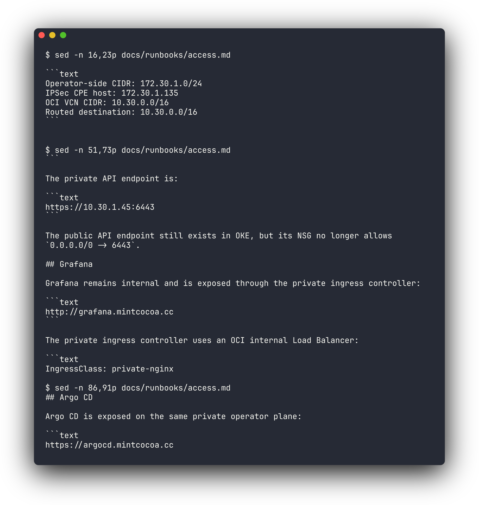

# MintCocoa Production Infrastructure Architecture

오라클 클라우드 기반 k8s 환경을 클러스터와 인프라를 구축한 과정을 설명한 문서입니다. 홈랩에 의존하는 단일 서버 실험을 넘어 실제 운영시 발생할 문제사항을 고려하여 개발과 프로덕션 환경 분리, 관측성, 접근 권한 문제를 가정하며 설계했습니다.

## 1. 기존 실험 환경과 설계 기준

초기에는 집에서 작은 서버 한 대로 하면서 빠르게 세팅할 수 있고 네트워크와 시스템 설정을 직접 다루면서 배울 수 있다는 장점이 있었지만, 네트워크 대역 제한, 집 네트워크에 의존하는 트래픽 경로와 같이 실전적인 환경이 아니라는 한계가 있었습니다.

그래서 오라클 클라우드의 프리 티어 OKE 클러스터를 이용해 프로덕션과 개발 환경을 분리한다면 home lab의 제약에서 벗어나 실제 프로덕션 환경과 더 유사한 조건에서 운영을 검증할 수 있을 것이라고 판단했습니다.

## 2. Cluster와 GitOps Repo 구조

먼저 클러스터 안에서 사용자 트래픽, GitOps 제어, 운영자 접근 개념을 분리하고 namespace, ingress class, load balancer, 접근 경로 기준으로 나누었습니다.

| Plane | 책임 | 대표 구성 |
| --- | --- | --- |
| Public service plane | 외부 사용자가 접근하는 서비스 노출 | `docs.mintcocoa.dev`, `drop.mintcocoa.dev`, `demo.mintcocoa.dev`, public `nginx` ingress |
| GitOps control plane | staging/prod desired state 선언과 수렴 | `mintcocoa-ops`, GitOps manager Argo CD, Kustomize overlays |
| Private operator plane | 운영자 접근과 관측성 UI | private Kubernetes API, OCI IPSec/GitOps manager, private Grafana ingress |

## 2. OCI VCN과 Kubernetes Cluster 구성

| 영역 | 구성 |
| --- | --- |
| Cloud provider | Oracle Cloud Infrastructure |
| Region | `ap-chuncheon-1` |
| VCN | `10.30.0.0/16` |
| Kubernetes | OKE basic cluster, Kubernetes `v1.33.1` |
| Node pool | `VM.Standard.A1.Flex`, 3 worker nodes |
| CNI | OCI VCN native pod networking |
| Node OS | Oracle Linux 8 managed node image |

## 3. Network Boundary와 Security Group

public ingress와 private ingress는 외부 노출 경로와 내부 경로를 분리하기 위해 public host는 외부 사용자 트래픽을 받고, operator-only host는 private access path 안에서만 사용합니다.

public-facing 리소스는 Internet Gateway 경로를 사용하고, pod outbound traffic은 NAT Gateway 경로를 사용하도록 해 public ingress와 private API, pod outbound traffic의 경로를 분리했습니다.

VCN은 역할별 subnet으로 나누어집니다. endpoint subnet은 Kubernetes API endpoint를 위한 공간이고, pods subnet은 OCI VCN native CNI가 자동으로 pod address를 할당하는 영역이므로 별도 CNI를 둘 필요가 없었습니다. management subnet은 집 내부망에서 IPSec 경로로 접근하는 management k3s/Argo CD GitOps manager VM 영역입니다.

보안 그룹(NSG)은 Kubernetes API 접근, node/pod traffic, public/private ingress traffic, GitOps manager 접근 기준으로 나누어 설정했습니다.

| Component | Role |
| --- | --- |
| Internet Gateway | public ingress와 OKE public endpoint |
| NAT Gateway | pod subnet의 outbound traffic |
| Control plane NSG | Kubernetes API 접근 제한 |
| Workers NSG | node와 pod traffic 경계 |
| Load balancer NSG | public/private ingress load balancer traffic 경계 |
| Manager NSG | home LAN SSH/HTTPS, GitOps management 진입점 |

운영면에서의 접근은 public user traffic과 분리했습니다. 외부 사용자는 public DNS와 public ingress를 통해 서비스에 접근하지만, 운영자는 home LAN에서 Raspberry Pi IPSec CPE와 GitOps manager를 거쳐 private 운영 경로에 들어옵니다.

public internet에 직접 노출되는 면적을 줄이고,어디서 접속할 수 있는지를 home LAN과 GitOps manager 범위 안에서 통제하기 위해서 이렇게 제한 된 접근 경로로 설정했습니다.

## 4. GitOps Control Plane

Production desired state는 prod 클러스터가 최종적으로 어떤 상태여야 하는지를 의미하고, 모든 상태를 mintcocoa-ops 저장소 안에 선언적으로 표현, Argo CD가 이를 실제 prod 클러스터 상태와 비교해 일치하도록 관리합니다.

OCI 위에는 GitOps manager VM이 있고, 그 안의 management k3s 클러스터에서 Argo CD가 동작합니다. 이 Argo CD가 mintcocoa-ops 저장소를 바라보면서 “Git에 적힌 상태”와 “실제 Kubernetes 클러스터 상태”를 비교합니다.

GitOps repo는 역할별 root application으로 나누어집니다.

- manager-root: management 영역 상태를 관리
- staging-root: staging 클러스터 상태를 관리
- prod-root: production 클러스터 상태를 관리

각 root application은 Kustomize로 구성되어 있고, staging/prod overlay로 나뉩니다. staging은 빠르게 검증할 수 있도록 자동 Sync로 두고, prod는 수동 Sync로 두어 운영자가 변경 내용을 검토하고 승인할 수 있도록 했습니다.

production으로 보낼 때는 `mintcocoa-ops`의 promotion workflow가 staging overlay의 현재 `newName`/`newTag`를 읽어 `apps/<app>/overlays/prod/kustomization.yaml`로 복사하는 PR을 만듭니다.

이 PR이 merge되면 prod-root가 변경을 감지해 `OutOfSync`로 표시되고, 운영자가 diff와 staging 응답, GitHub Actions validation을 확인한 뒤 수동 Sync합니다. 이렇게 하면 production 배포 의도가 GitHub PR과 Argo CD operation 양쪽에 남게 되어 문제 발생 시 어느 단계에서 의도와 실제 상태가 달라졌는지 추적하기 쉽습니다.
