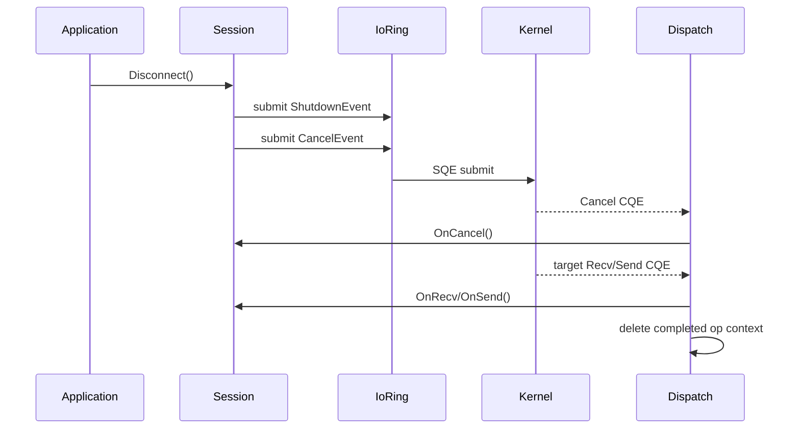
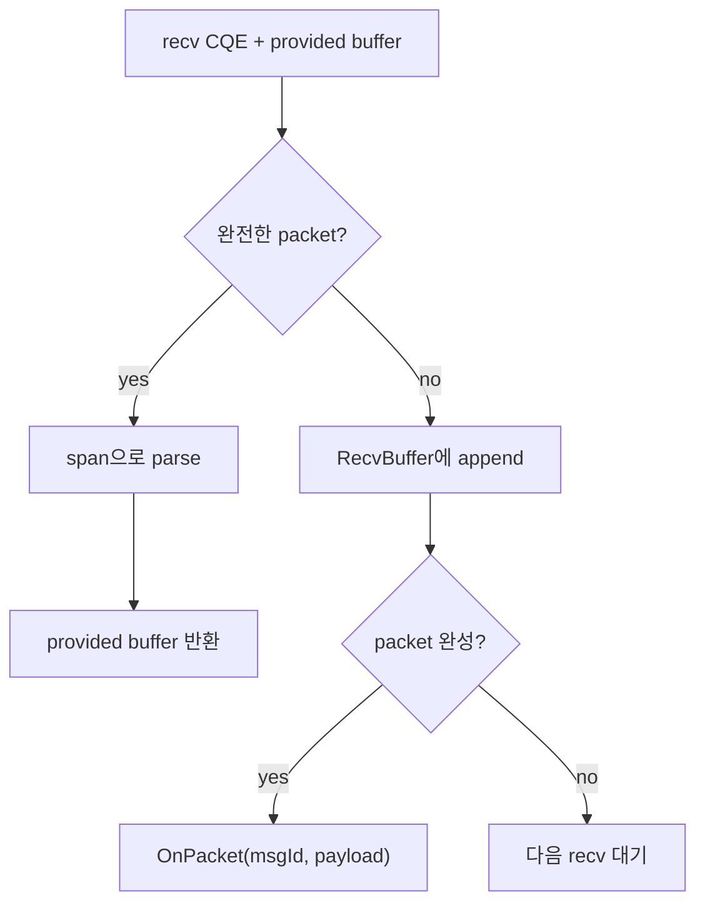
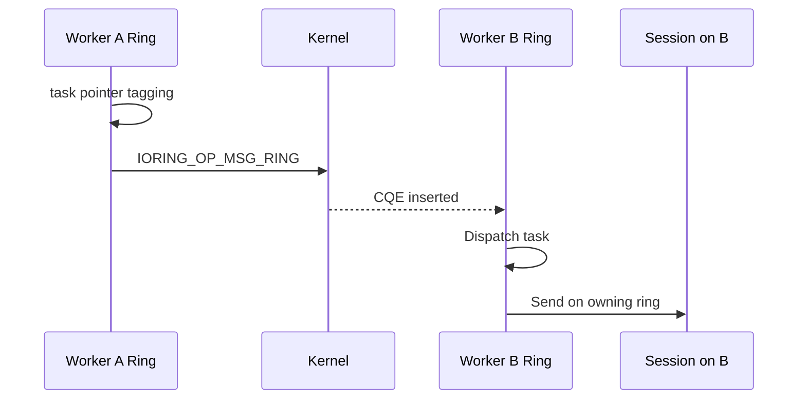
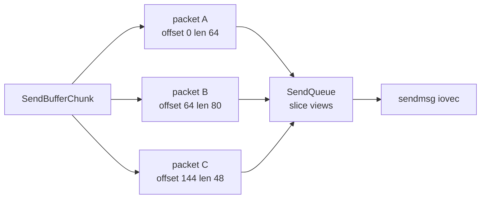

# 서버 Runtime 문제 해결 노트

이 문서는 `io_uring` 기반 C++ 서버 Runtime을 구현하면서 실제로 문제가 되었던 지점을 정리한 예시 페이지입니다. 전체 아키텍처 소개보다, 런타임 안정성에 직접 영향을 준 문제와 해결 방식에 집중합니다.

## 한눈에 보기

| 영역 | 문제 | 해결 |
|---|---|---|
| 세션 수명 | 연결 종료 후 늦은 CQE가 해제된 `Session`을 참조 | SQE마다 heap op context를 두고 CQE까지 owner/buffer 수명 유지 |
| 부분 수신 | TCP stream에는 message boundary가 없음 | `RecvBuffer`에 누적하고 완전한 packet만 dispatch |
| 부분 송신 | `sendmsg`가 요청 byte 전체를 한 번에 보내지 못할 수 있음 | `SendOp`이 `iovec`과 buffer ref를 소유하고 short write retry |
| 타 ring 전달 | 세션은 accept된 ring에 종속됨 | `IORING_OP_MSG_RING`으로 target ring의 CQ에 task 삽입 |
| 작은 payload | 작은 요청마다 chunk를 새로 잡으면 queue 조각화 증가 | 하나의 send buffer chunk에 여러 payload를 offset/length view로 적재 |

## 1. 세션 수명관리

### 문제 상황

대량 접속과 해제를 반복하는 테스트에서 간헐적인 `SEGFAULT`가 발생했습니다. 크래시 지점은 대부분 CQE callback에서 `Session` 멤버에 접근하는 부분이었습니다.

원인은 애플리케이션의 세션 종료 시점과 kernel I/O 완료 시점이 다르다는 점입니다. 애플리케이션이 `Disconnect()`를 호출해도 kernel에는 아직 완료되지 않은 op가 남아 있을 수 있습니다.

- `Multishot Recv`
- `Send`
- `Timeout`
- `Shutdown`
- `Cancel`

특히 cancel은 요청 자체의 CQE와 cancel 대상 op의 CQE가 별도로 도착합니다. cancel CQE가 왔다고 해서 대상 recv/send/timeout op까지 정리됐다고 볼 수 없습니다.

### 해결 방식

`user_data`에 `Session*`를 직접 넣지 않고, 각 SQE마다 독립적인 heap operation context를 둡니다. 이 op context가 CQE 도착까지 handler owner와 송수신 buffer를 붙잡습니다.

```cpp
class IoEvent {
public:
    EventHandlerRef Owner() const { return strong_owner_; }

    void SetStrongOwner(EventHandlerRef owner) {
        strong_owner_ = std::move(owner);
    }

    bool ShouldDeleteAfterDispatch(std::int32_t result,
                                   std::uint32_t flags) noexcept {
        if (!auto_delete_) {
            return false;
        }
        if (retain_after_dispatch_) {
            retain_after_dispatch_ = false;
            return false;
        }
        return Complete(result, flags);
    }

private:
    EventHandlerRef strong_owner_;
    bool auto_delete_{false};
    bool retain_after_dispatch_{false};
};
```

`IoRing::Dispatch()`는 CQE의 `user_data`를 `IoEvent*`로 복원하고 owner에게 전달합니다. op가 최종 완료되면 dispatch 이후 삭제합니다.

```cpp
auto* ev = reinterpret_cast<IoEvent*>(cqe->user_data);
auto owner = ev->Owner();

if (owner) {
    owner->Dispatch(ev, cqe->res, cqe->flags);
}

if (ev->ShouldDeleteAfterDispatch(cqe->res, cqe->flags)) {
    delete ev;
}
```

이 구조에서 `Session`의 free 시점은 `Disconnect()` 호출 시점이 아닙니다. 세션을 strong owner로 잡고 있던 op context들이 모두 CQE를 받고 삭제된 뒤에 자연스럽게 해제됩니다.



## 2. 부분 수신 처리

### 문제 상황

TCP는 byte stream입니다. 송신자가 하나의 packet을 보냈더라도 수신자는 다음처럼 받을 수 있습니다.

- packet 하나가 여러 recv CQE로 나뉘어 도착
- 여러 packet이 하나의 recv CQE에 붙어서 도착
- header 일부만 먼저 도착

또한 Provided Buffer Ring을 사용할 때 모든 buffer가 사용 중이면 `ENOBUFS`가 발생할 수 있습니다. 이때 multishot recv가 해제되므로, 감지하지 못하면 해당 세션의 수신이 멈춘 것처럼 보입니다.

### 해결 방식

수신 경로는 fast path와 slow path로 나눕니다.

| 경로 | 조건 | 처리 |
|---|---|---|
| Fast path | 하나의 provided buffer 안에 완전한 packet이 있음 | `span`으로 직접 읽고 즉시 buffer 반환 |
| Slow path | packet이 여러 CQE로 나뉨 | `RecvBuffer`에 복사 후 완전한 packet까지 누적 |
| Recovery | `ENOBUFS` 또는 multishot 종료 | `RegisterRecv()`로 recv op 재등록 |

게임 packet은 다음 header를 기준으로 재조립합니다.

```text
[size:uint16][msgId:uint16][payload...]
```

핵심은 provided buffer를 오래 붙잡지 않는 것입니다. 상위 프로토콜 처리가 늦어져도 kernel buffer가 점유되면 다른 세션의 buffer 고갈로 이어질 수 있으므로, 필요한 데이터는 애플리케이션 소유 `RecvBuffer`로 복사하고 provided buffer는 빠르게 반환합니다.



## 3. 부분 송신 처리

### 문제 상황

송신도 한 번의 submit으로 끝난다고 가정할 수 없습니다. `sendmsg`는 요청한 byte보다 적은 byte만 보낸 뒤 완료될 수 있습니다.

이때 다음 문제가 발생할 수 있습니다.

- payload memory가 send CQE 전에 해제됨
- 어느 `iovec`까지 전송됐는지 추적하지 못함
- retry 시 이미 보낸 byte를 중복 전송함
- dispatch 중 재제출한 op가 자동 삭제되어 dangling pointer가 됨

### 해결 방식

`SendOp`이 송신에 필요한 상태를 직접 소유합니다.

```cpp
struct SendOp final : ring::SendEvent {
    msghdr msg{};
    std::vector<iovec> iovecs;
    std::vector<SendBufferRef> buffers;
};
```

부분 송신이 발생하면 완료 byte 수만큼 `iovec`의 시작 위치와 길이를 보정하고 같은 op를 재제출합니다.

```cpp
void AdjustIovecsAfterShortWrite(SendOp& op, std::size_t sent) {
    while (sent > 0 && !op.iovecs.empty()) {
        auto& iov = op.iovecs.front();

        if (sent >= iov.iov_len) {
            sent -= iov.iov_len;
            op.iovecs.erase(op.iovecs.begin());
            continue;
        }

        iov.iov_base = static_cast<std::byte*>(iov.iov_base) + sent;
        iov.iov_len -= sent;
        sent = 0;
    }
}
```

dispatch 중 같은 op를 다시 제출하는 경우에는 `RetainAfterDispatch()`가 필요합니다. 현재 CQE 처리가 끝났다고 op를 삭제하면 재제출된 SQE의 `user_data`가 dangling pointer가 되기 때문입니다.

## 4. MSG_RING 기반 타 ring 전달

### 문제 상황

Runtime은 ring-per-thread 구조입니다. 세션은 accept된 ring에 종속되고, 이후 recv/send도 같은 ring에서 처리됩니다.

이 구조는 세션 수명과 cache locality에는 유리하지만, Room broadcast처럼 다른 worker의 세션으로 작업을 보내야 하는 경우 문제가 됩니다. 세션을 다른 worker에서 직접 만지면 ring 소유권과 수명관리가 흐려집니다.

### 해결 방식

`IORING_OP_MSG_RING`으로 target ring의 CQ에 task를 직접 삽입합니다. 세션을 다른 worker로 옮기지 않고, 해당 세션이 속한 ring에서 실행해야 하는 일만 target ring으로 보냅니다.

`user_data`의 bit 0을 task flag로 사용합니다.

| `user_data` 형태 | 의미 |
|---|---|
| `IoEvent*` | 일반 I/O 완료 이벤트 |
| `task_ptr \| 0x1` | MSG_RING으로 전달된 task |

```cpp
bool IoRing::RunOnRing(std::move_only_function<void()> task) {
    if (Current() == this) {
        task();
        return true;
    }

    auto* task_ptr = new std::move_only_function<void()>(std::move(task));
    std::uint64_t tagged =
        reinterpret_cast<std::uint64_t>(task_ptr) | 0x1ULL;

    io_uring_sqe* sqe = io_uring_get_sqe(Current()->Raw());
    io_uring_prep_msg_ring(sqe, Fd(), 0, tagged, 0);
    sqe->flags |= IOSQE_CQE_SKIP_SUCCESS;
    io_uring_submit(Current()->Raw());
    return true;
}
```

target ring의 dispatch loop에서는 bit 0으로 일반 I/O와 task를 구분합니다.

```cpp
if (data & 0x1ULL) {
    auto* task = reinterpret_cast<std::move_only_function<void()>*>(
        data & ~0x1ULL);
    (*task)();
    delete task;
    return;
}
```



## 5. 작은 요청을 send buffer chunk에 함께 적재

### 문제 상황

작은 게임 packet이나 짧은 HTTP 응답마다 send buffer chunk를 하나씩 할당하면 비효율이 커집니다.

- chunk 내부 남은 공간이 버려짐
- send queue에 작은 buffer 조각이 많이 쌓임
- `iovec` 수가 증가함
- partial send 보정 범위가 복잡해짐
- backpressure accounting 단위가 지나치게 잘게 쪼개짐

### 해결 방식

작은 payload는 하나의 send buffer chunk 안에 순차적으로 적재합니다. chunk는 실제 메모리 블록을 소유하고, send queue에는 `(offset, length)` view만 올라갑니다.

| 항목 | 역할 |
|---|---|
| chunk | 실제 payload memory 소유 |
| write cursor | chunk 안에서 다음 payload를 기록할 위치 |
| offset/length view | send queue가 참조하는 송신 범위 |
| `SendBufferRef` | send CQE 완료까지 chunk 수명 유지 |
| iovec | kernel에 넘기는 실제 byte range |

```cpp
struct SendSlice {
    SendBufferRef chunk;
    std::size_t offset{};
    std::size_t length{};
};

std::optional<SendSlice> SendChunk::TryAppend(std::span<const std::byte> payload) {
    if (write_offset_ + payload.size() > data_.size()) {
        return std::nullopt;
    }

    const auto offset = write_offset_;
    std::memcpy(data_.data() + write_offset_, payload.data(), payload.size());
    write_offset_ += payload.size();

    return SendSlice{
        .chunk = shared_from_this(),
        .offset = offset,
        .length = payload.size(),
    };
}
```

이 방식은 작은 payload 여러 개를 하나의 메모리 chunk에 모으면서도, kernel에는 `iovec`으로 정확한 범위만 전달할 수 있습니다.



## 발표용 요약

이 Runtime에서 가장 중요한 문제는 `io_uring` 완료 이벤트가 애플리케이션 객체의 종료 시점보다 늦게 올 수 있다는 점입니다. 그래서 `user_data`에 `Session*`를 직접 넣지 않고, SQE마다 독립적인 op context를 둡니다.

수신은 Provided Buffer를 사용하되 TCP stream 단편화를 고려해 완전한 packet만 바로 처리하고, 단편 packet은 `RecvBuffer`에서 재조립합니다. 송신은 `SendOp`이 `iovec`과 buffer reference를 소유해 short write가 발생해도 남은 범위만 보정해 재제출합니다.

멀티스레드에서는 세션이 accept된 ring에 묶이므로, 다른 worker의 세션을 직접 만지지 않습니다. 대신 `MSG_RING`으로 target ring의 CQ에 task를 넣고, 그 ring의 dispatch loop에서 send 같은 세션 작업을 실행합니다. 작은 payload는 하나의 send buffer chunk에 여러 개를 적재해 메모리 낭비와 queue 조각화를 줄입니다.
